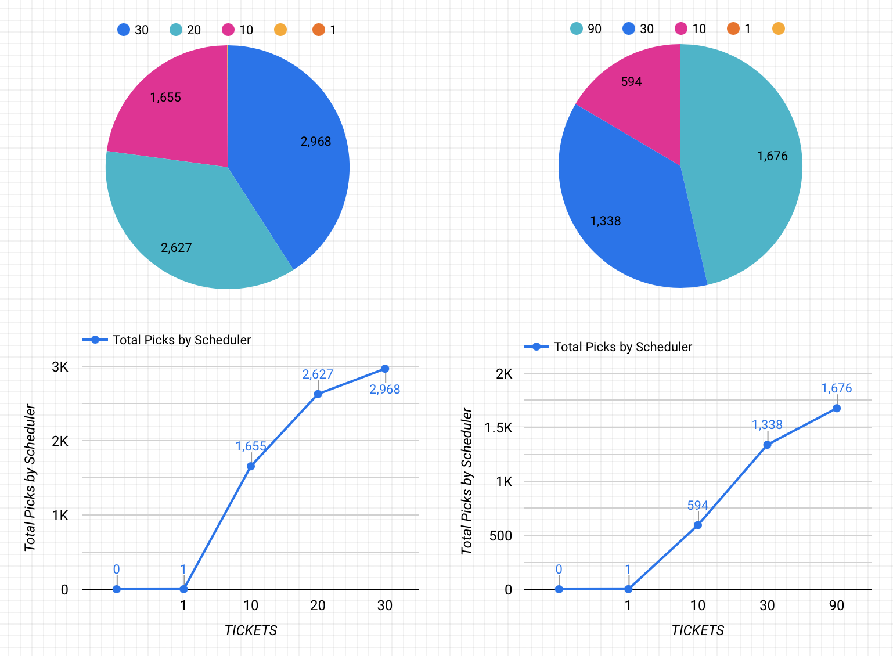

**CS361 - Lottery Scheduler Project**

**by Andrei Cozma, due March 17th 2021**

GitHub Link: [https://github.com/andreicozma1/xv6-public](https://github.com/andreicozma1/xv6-public) (fork)

In this project, we are replacing the default scheduler (Round Robin) in xv6 with a Lottery Scheduler. In this type of scheduler, each running process is assigned a slice of the processor that is proportional to the number of tickets assigned to a process. A random number generator is used to run the randomized lottery and pick the winner, which is the process that gets to run for that time slice.

## Function Implementations (settickets and getpinfo)

To start, the **settickets **function was implemented in order to set the number of tickets for the calling process. Since by default each process starts with 1 ticket, we first add an integer field in the **proc** structure in** proc.h** and we assign the number of tickets to 1 in the **allocproc()** function and to 0 in the **exit()** and **kill()** functions in **proc.c**, since we want to ensure that memory is reset for a process that exits. A child process inherits the same number of tickets as its parent process, thus we must handle this implementation in the **fork()** function in **proc.c.** 

Another integer field called **total_tickets** is added to the **ptable **structure in **proc.c**, in order to have a reference of the total number of tickets allotted when picking the lottery winner. The value is incremented when **allocproc()** is called, adjusted if **settickets()** is called, and decremented if **exit()** or **kill()** are called. Finally, the settickets function **returns -1** if the number of tickets requested is **< 1** and otherwise it sets the current process’ number of **tickets** and increments the **total_tickets** counter.

Another field called** ticks** is added in the **proc** structure in order to test that processes with a greater amount of tickets are allowed more priority in scheduling. We can then increment this field every time a process gets picked in the **scheduler** function in **proc.c.**

The **getpinfo**** **function is implemented by filling a pstat structure containing arrays with fields such as **inuse**, **tickets**, **pid**, and **ticks** corresponding with values for **each process** within the **proc** data structure in the **ptable**. We simply do so by iterating from 0 to NPROC and setting the array values for each process at each iteration. The function returns -1 if the stat pointer is invalid and 0 if the function executed successfully.

## Lottery Scheduler Implementation

In order to implement the lottery scheduler, we must use a pseudo-random number generator, which is added to a file called **random.c. **The implementation is free software under the GNU Library General Public license. In the **scheduler()** function in **proc.c** we add two integer variables, **counter** and **winner**, where counter is reset to 0 every scheduler loop, and a new winner is picked by generating a **random** number between 0 and the total number of tickets. The scheduler then loops through all the processes found in the **ptable.proc** array. As we loop through the array, we only consider processes that have the state **RUNNABLE**, increment the counter by the number of tickets of the current process, and if **counter >= winner**, the process wins the lottery and is allowed run-time. Next scheduler loop iteration, a new winner is picked through the same process.

## System Calls

We must make the **settickets()** and **getpinfo****()** functions accessible as a **system call** for an user program. In order to do this, the function prototypes for these functions and the **pstat** struct in **defs.h** and **user.h.** The header file defs.h contains all functions calls accessible by the kernel itself, and the user.h file is a subset of defs.h which are system calls accessible by a user program. Two new entries are added to **usys.S** for declaring the new system calls, one for settickets, and one for getpinfo. In **sysproc.c** we implement **sys_settickets(void)**, where we retrieve the argument, acquire a tickslock, **call the settickets() function** from proc.c, release the tickslock and return the result. Also in **sysproc.c**, a function called **sys_getpinfo(void) **is implemented, where we simply use the getpinfo() function to fill in the structure and return the result. In **syscall.c** we extern the sys functions we added in **sysproc.c** and add their signatures to the static int array of syscalls, and assign system call numbers to the two functions is **syscall.h**.

## Program Implementations (ps and test)

The **ps.c** file is implemented and added for compilation within the **Makefile**. In the main function of the ps program, a new **pstat** structure is allocated on the heap, the **getpinfo**(stat) system call is used to fill the structure. If the system call succeeded, the structure is printed out with the corresponding values for each process in a for loop. If the system call fails, an error is printed to the console and program exits.

The **test.c **file is implemented and added for compilation within the Makefile. In the main function of the test program, we test the lottery scheduler by forking 3 processes with different ticket values (10, 20, 30) as well as (10, 30, 90). We print out data from within the scheduler to analyze the amount of times each one of the three processes is picked to run. The graphs generated with this data are shown at the picture attached at the bottom of this report. From these graphs we can notice that the processes with more tickets get approximately proportionally picked more than the processes with less tickets. Any inconsistencies within the data may be due to the length of the dataset or imperfections within the pseudo-random number generator.

## Graph Analysis

## List of Changes

in **proc.c:**

* implement **int settickets(int number)**

* implement int **getpinfo****(struct pstat *pstat)**

* Add field **int total_tickets** in **ptable struct.**

* in **fork()**, assign same number of tickets to child as the parent.

* in **exit()**, set tickets and ticks to 0 and decrement total_tickets

* in **kill()**, set tickets and ticks to 0 and decrement total_tickets

* in **scheduler()**

    * add integer variables counter and winner

    * every scheduler loop, set counter to 0 and set winner to a random number between 0 and the total number of tickets

    * loop through all processes in ptable.proc, pick the winner of the lottery and increment ticks.

in **proc.h:**

* add **int tickets** to the proc struct

* add **int ticks** to the proc struct

in **pstat.h:**

* add structure definition for** pstat.**

in** random.c:**

* Pseudo-random number generator

* GNU Library General Public License 

in **defs.h **and** user.h:**

* add **struct pstat;**

* add **int settickets(int);**

* add **int getpinfo(struct pstat*);**

in **usys.S:**

* SYSCALL(settickets)

* SYSCALL(getpinfo)

in **sysproc.c:**

* implement int **sys_settickets**(void) which uses **settickets** from proc.c

* implement int **sys_getpinfo**(void) which uses **getpinfo** from proc.

in **syscall.c:**

* extern int **sys_settickets**(void); 

* extern int **sys_settickets**(void); 

* add syscall signatures to** static int (*syscalls[])(void)**

in **syscall.h:**

* #define SYS_settickets 22

* #define SYS_getpinfo 23

in **ps.c:**

* implement program to use **getpinfo system call** and print out process list info.

in **test.c:**

* implement program to fork 3 programs and use the settickets system call to test lottery scheduler.

in **Makefile:**

* add new programs (ps and test) and ensure any new files get compiled.

